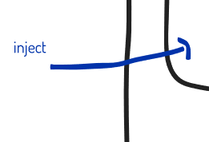
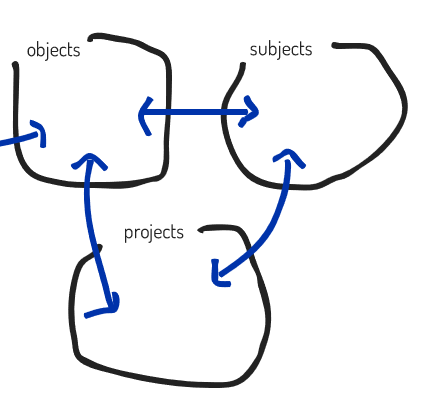
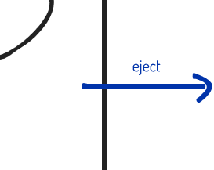
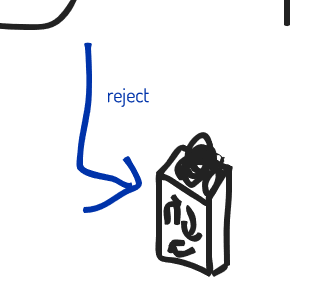

# jects method
[English Version](index_EN.md) | [GitHub](https://github.com/stakiran/jects-method)

## Overview
Personal information management by yourself, for yourself, is surprisingly difficult. GTD is bulky and hard to grasp, and the PARA Method is hierarchical and tends to be love-it-or-hate-it. The same goes for other genres known as PKM. You can build your own system, and it can be fun, but it's not something an amateur can truly compete with. It usually takes 10 years to arrive at a system that fits you.

That's not great, so I created a simple concept. Almost anyone can get to the starting line with it.

It's called the jects method. It's an information management method. It consists of a model that views information management through six "-jects," and an operational loop for how to run it.

## Model

### Big picture
It looks like this: one input, two outputs, and one box.

In other words, the jects method assumes "a box with one entrance and two exits" and "three smaller boxes inside the box." You just need to **implement these six concepts in your own way**. With only these six, you can cover information management end to end.

Now let's look at the details.

### inject
This is the entrance. It indicates the part where you put things into the box.

inject connects to object. That means you must think about **what to put into object, and how**. Put differently, that's all you need to think about. Decide, in your own way, what you will put in and what you will not.

At minimum, "put everything in" does not work. Operating the box depends on your capacity, so you must keep it within what you can handle. Too many people fail to understand this, avoid facing their own capacity, and try to put in absolutely everything. You must not run away. Face yourself.

### object, subject, project
This is the box. It contains three smaller boxes.

object is the small box that holds unprocessed items. It's also the entrance that receives from inject. In GTD terms it's the inbox; in email terms it's your inbox. It represents "unprocessed things."

Anyway, first, you dump everything into object. This is the same idea as GTD and an inbox, but that's simply how it works. You must not run from this idea of **"first, accumulate things as unprocessed."**

subject is the small box that holds matters related to orientation/direction. Examples:

- Vision
- Motto
- Things you want to keep in mind
- Reflections on yesterday
- AoR (Area of Responsibility) in the PARA Method
    - For example, if it's "I want to be healthy," then the AoR is "I want to be healthy." The idea is that by looking at this AoR every day, you generate the tasks and actions needed to become healthy on a daily basis. Since it's the source that produces tasks, I call it a "task source"

**subject is something you look at.** By looking at it, you turn it into daily tasks, take action, or keep it strongly in mind so you can bring it out at the right time. Because it involves action, it's not like simple memorization for a test. How many subjects you carry, how you reread them, and how you practice them varies completely by person, and you must establish your own way.

project is the small box that holds matters you've committed to executing. Examples:

- Tasks
- Actions
- TODOs
- Projects

There are countless labels, so you don't need to worry about wording. Also, it doesn't matter whether someone told you to do it, you want to do it, how important it is, or what the business impact is. **Anything you perceive as "committed" goes into project.** Conversely, that's it: what you did not commit to must not be treated as a project. In other words, your own decision-making is what matters. Unless you realize and practice this essence, you can't manage information. And the criteria for making those decisions are maintained as subject.

One more thing: you also need to think for yourself about how to handle project. This genre is called task management. I've already organized it, so if you'd like, see here ([Japanese](https://zenn.dev/sta/books/taskmanagement-kamikudaku) [English](https://zenn.dev/sta/books/tasukami-english)).

### eject
This is an exit. In particular, it's the exit for communicating to others.

It includes every kind of submission: from casual communication to formal presentations, and of course publishing and uploading. **You must think for yourself what submission methods exist, and when to use which and for what.**

Also, **eject should be considered separately from project**. eject means influencing other people, which makes it a very special kind of task. That's why it's separated. project broadly handles the majority of things that are not like that.

### reject
This is an exit. Unlike eject, you don't show it to others. You simply throw it away. The nuance is refusing to let it live in your system and banishing it.

This is equivalent to the kind of decision-making often discussed in self-help, such as **what not to do** or **what to discard**. Of course, just deciding isn't enough; **you need the actual action of discarding**.

However, reject is also a container, essentially corresponding to a trash can. In other words, **you keep what you've thrown away**. Like a trash can, you can also restore it later.

## Operation
- 1: Among all information, put what you want to manage with the jects method into inject
- 2: What you put into inject should ultimately be moved into object
- ===
- 3: Process the three boxes
    - Process what is in object as needed, or periodically
    - You will likely process what is in project daily
    - Process what is in subject frequently
- 4: Process newly arisen matters
    - Put what can be discarded into reject
    - Put what can be sent outward into eject
    - If it can go into the box, put it into one of the three small boxes
    - Throw away what doesn't fit anywhere (don't even put it into reject)
- ===
- 5: Process reject
    - Look at what's in reject, and if there are no issues, discard it completely (equivalent to emptying the trash)
- 6: Process eject
    - Look at what's in eject, and for items that can be sent outward, start concrete work on them or manage them

## Summary
- A method for building personal information management by yourself, for yourself
- Capture it with six jects, and design each in your own way
- Be mindful of the following flow and what is special
    - Select what to put into the box in the form of inject
    - Always connect inject to object
    - Coordination among the three boxes: object, subject, project. All are internal
    - Implement a trash-can function in the form of reject
    - Manage external impact in the form of eject. It's external and should be considered separately from project

As a fundamental premise, building your own information management is extremely hard. But as long as you keep the jects method in mind, you won't get lost. The road may be very steep, and that is probably the more likely outcome.